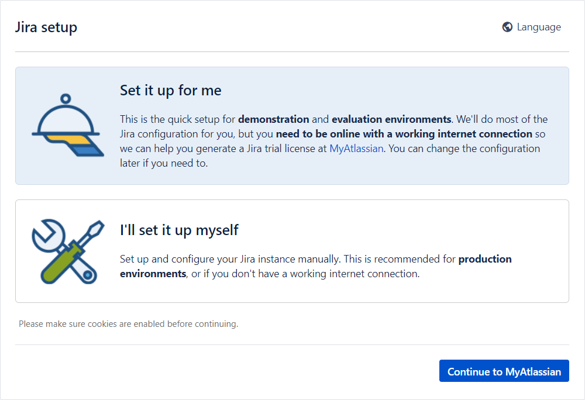
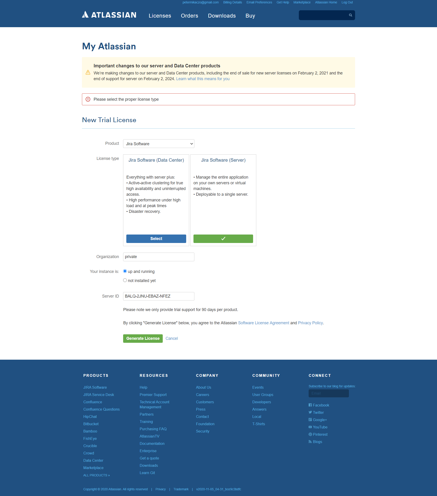
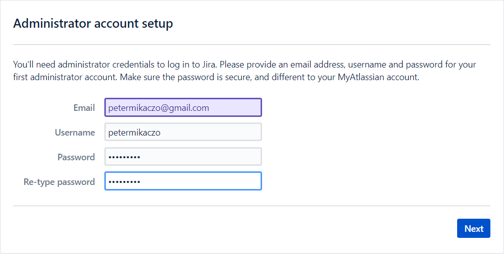
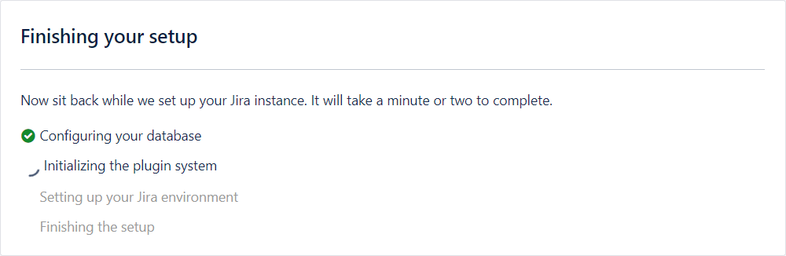
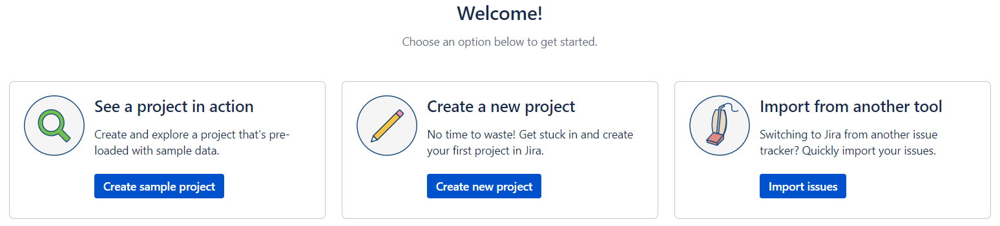

# Vagrant Jira server

With this repository you can create a local Jira server implementation with vagrant (CentOS 7 VM).

Ideal for local testing, or Jira tryout.

# Table of contents

- [Vagrant Jira server](#vagrant-jira-server)
- [Table of contents](#table-of-contents)
  - [Usage](#usage)
    - [Dependencies](#dependencies)
    - [First usage](#first-usage)
    - [After initial setup](#after-initial-setup)
  - [Used technologies & Software](#used-technologies--software)
    - [bash script](#bash-script)
    - [Visual Studio Code](#visual-studio-code)
    - [Vagrant](#vagrant)
  - [Describe files](#describe-files)
    - [Vagrantfile](#vagrantfile)
    - [README.md](#readmemd)
    - [LICENSE](#license)
    - [2_start.ps1](#2_startps1)
    - [1_install.cmd](#1_installcmd)
    - [.gitignore](#gitignore)
    - [tools\downloader.js](#toolsdownloaderjs)
    - [install_scripts\jira.sh](#install_scriptsjirash)
    - [files\response.varfile](#filesresponsevarfile)
    - [documentation](#documentation)
  - [License](#license-1)
  - [Author Information](#author-information)

## Usage

### Dependencies

From technology point of view:

- Installed Vagrant

- Windows OS (where you run 1_install.cmd)

### First usage

Simply Start `1_install.cmd`. When it was fully finished, expected to open a chrome browser with the WEB UI of the installed Jira server automatically.

### After initial setup

Choose "Set it up for me".

Login with your Atlassian account. If no any, create.

- Required to assign server id for your installation. It has a trial option, no need to buy it.

Select "Jira Software (Sever)" license type, give an organization and click to "Generate License".

Setup your Administrator account. These information will be used, when you would like to login or administrate your local Jira server.

Wait till post-installation will be finished.

Click to "Let's get started".

Select your language.

You can start to use your new, freshly installed Jira server.

## Used technologies & Software

### bash script

Bash script is responsible to install jira server to the VM.

### Visual Studio Code

This IDE was used to prepare and handle all of the code.

### Vagrant

[Vagrant](https://www.vagrantup.com/) is a hashicorp tool which provides you a way to spin up a virtual machine in your local computer (via virtualbox). It is ideal to reproduce the server in your local computer, without any cloud provider.

## Describe files

### Vagrantfile

Settings of VM created by vagrant.

### README.md

This file, what you are reading now. It is in [Markdown](https://www.markdownguide.org/getting-started/) language.

### LICENSE

License file.

### 2_start.ps1

PowerShell script, responsible to execute a `vagrant up` command and open chrome browser with installed Jira server's URL. Chain-loaded by `1_install.cmd`.

### 1_install.cmd

[Windows batch file](https://en.wikipedia.org/wiki/Batch_file) responsible to download required binary for Jira server installation by `.\tools\downloader.js` JavaScript file.

### .gitignore

File to define excluded files, folders, patterns by git.

### tools\downloader.js

Simple JavaScript file to download specific file from the internet.

### install_scripts\jira.sh

Bash script to install Jira server to the VM created by vagrant.

### files\response.varfile

Answers file to be able to install Jira server without any user interaction (unattended / Silent installation)

### documentation

Folder to store required materials for documentation, like pictures.

## License

MIT

## Author Information

Peter Mikaczo - <petermikaczo@gmail.com>